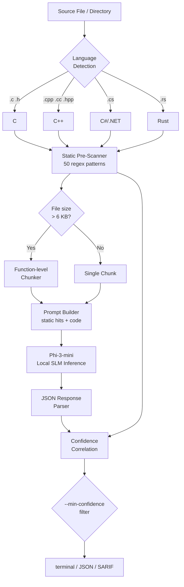

<div align="center">


# slm-audit

**Local SLM-powered multi-language security code auditor**

> Combines deterministic static analysis with on-device Phi-3 inference.<br>
> 100% offline — no API keys, no telemetry, no code leaves your machine.

[](https://github.com/anubhavg-icpl/slm-l)
[](https://github.com/anubhavg-icpl/slm-l)
[](LICENSE)
[](https://www.rust-lang.org)
[](https://huggingface.co/microsoft/Phi-3-mini-4k-instruct)
[](#model-configuration)
[](#output-formats)

<br>


</div>

---

## Contents

- [Overview](#overview)
- [How It Works](#how-it-works)
- [Features](#features)
- [Supported Languages & Patterns](#supported-languages--patterns)
- [Quick Start](#quick-start)
- [Usage](#usage)
- [Output Formats](#output-formats)
- [Model Configuration](#model-configuration)
- [CI / GitHub Code Scanning Integration](#ci--github-code-scanning-integration)
- [Production Deployment](#production-deployment)
- [Roadmap](#roadmap)
- [Contributing](#contributing)
- [License](#license)

---

## Overview

`slm-audit` is a command-line security scanner built entirely in Rust that audits **C, C++, C#/.NET, and Rust** source code for security vulnerabilities — without sending a single byte to the cloud.

Unlike SaaS SAST tools, `slm-audit` runs a local small language model (Phi-3-mini, ~2.2 GB) directly on your hardware:

- **Air-gapped friendly** — works in isolated, classified, or regulatory-constrained environments
- **Zero data exfiltration risk** — proprietary source code never touches an external API
- **Semantic understanding** — the SLM catches logic-level vulnerabilities that regex alone misses
- **Two-layer detection** — fast static pre-scan feeds context into the SLM for deeper analysis
- **Confidence scoring** — findings corroborated by both layers surface as `HIGH` confidence
- **SARIF 2.1.0 output** — integrates natively with GitHub Code Scanning and VS Code

---

## How It Works



### Two-Layer Detection

| Layer | Speed | Scope |
|-------|-------|-------|
| Static regex pre-scan | < 100 ms | Known dangerous APIs and patterns |
| SLM semantic analysis | 5–60 s | Logic, data flow, contextual risk |

Findings confirmed by **both** layers receive `confidence: HIGH`. SLM-only findings receive `confidence: MEDIUM`.

---

## Features

| Feature | Status |
|---------|--------|
| C, C++, C#/.NET, Rust support | ✅ |
| 50+ static vulnerability patterns | ✅ |
| Local Phi-3 SLM inference via Kalosm | ✅ |
| Function-level chunking for large files | ✅ |
| Confidence scoring (LOW / MEDIUM / HIGH) | ✅ |
| `--min-confidence` filter | ✅ |
| Per-file inference timeout (`--timeout`) | ✅ |
| Terminal colored output | ✅ |
| JSON output (SIEM / XDR pipeable) | ✅ |
| SARIF 2.1.0 (GitHub Code Scanning) | ✅ |
| 17 unit tests | ✅ |
| 100% offline — zero external API calls | ✅ |
| Custom GGUF model support via `models.toml` | ✅ |

---

## Supported Languages & Patterns

### C — 12 patterns

| Pattern | Severity | Vulnerability |
|---------|----------|---------------|
| `gets` | CRITICAL | Buffer overflow — no bounds check |
| `system()` / `popen()` | CRITICAL | Command injection via shell |
| `strcpy` / `strcat` | HIGH | Buffer overflow |
| `sprintf` | HIGH | Buffer overflow |
| `scanf %s` without width | HIGH | Buffer overflow |
| `printf(user_var)` | HIGH | Format string injection |
| `malloc` return unchecked | MEDIUM | Null pointer dereference |
| `memcpy` unchecked size | MEDIUM | Buffer overflow |
| `rand()` for security | MEDIUM | Cryptographically weak PRNG |
| `atoi` | LOW | No error detection / overflow |

### C++ — 14 patterns

Includes all C patterns, plus:

| Pattern | Severity | Vulnerability |
|---------|----------|---------------|
| `new[]` without `delete[]` | HIGH | Memory leak / undefined behaviour |
| `reinterpret_cast` | HIGH | Strict aliasing violation |
| `throw` in destructor | HIGH | Calls `std::terminate` during unwinding |
| `const_cast` | MEDIUM | Const contract violation |
| Raw pointer arithmetic | MEDIUM | Off-by-one / out-of-bounds |
| C-style casts | LOW | Bypasses C++ type safety |

### C#/.NET — 13 patterns

| Pattern | Severity | Vulnerability |
|---------|----------|---------------|
| `SqlCommand` + string concatenation | CRITICAL | SQL injection |
| `string.Format` + SQL keywords | CRITICAL | SQL injection |
| `Process.Start` + concatenation | CRITICAL | Command injection |
| `BinaryFormatter` | CRITICAL | Insecure deserialization (RCE) |
| `LosFormatter` / `ObjectStateFormatter` | CRITICAL | Insecure deserialization |
| `File.Open(Request.*)` | HIGH | Path traversal |
| Hardcoded passwords / API keys | HIGH | Credential exposure |
| `MD5.Create` / `SHA1.Create` | HIGH | Broken cryptography |
| `new Random()` for security | MEDIUM | Cryptographically weak PRNG |
| `unsafe {}` block | MEDIUM | CLR memory safety bypass |
| `XmlDocument` / `XmlTextReader` | MEDIUM | XXE injection |
| `Assembly.Load` / `.Invoke` | MEDIUM | Reflection code injection |
| `new Regex(user_input)` | LOW | ReDoS |

### Rust — 11 patterns

| Pattern | Severity | Vulnerability |
|---------|----------|---------------|
| `std::mem::transmute` | HIGH | Type reinterpretation / undefined behaviour |
| `from_raw_parts` | HIGH | Unsafe slice construction |
| Raw pointer dereference | HIGH | Null / dangling pointer |
| `unsafe impl Send/Sync` | HIGH | False thread-safety guarantee |
| `unsafe {}` block | MEDIUM | Opt-out of memory safety |
| `mem::forget` | MEDIUM | Resource leak (skips `Drop`) |
| FFI `extern "C"` block | MEDIUM | Cross-boundary invariant violations |
| `as` numeric casts | LOW | Silent integer truncation |
| `.unwrap()` | LOW | Panic on `None` / `Err` |
| `.expect("...")` | LOW | Panic with message |
| `std::env::var` / `args` | LOW | Attacker-controlled input |

---

## Quick Start

### Prerequisites

| Requirement | Version |
|-------------|---------|
| Rust toolchain | 1.75+ |
| Free disk space | ~3 GB (model cache) |
| Internet access | First run only (model download) |

### Build

```bash
git clone https://github.com/anubhavg-icpl/slm-l.git
cd slm-l
cargo build --release
```

Binary: `./target/release/slm-audit`

### First Run

```bash
# Scan a C file — downloads Phi-3-mini (~2.2 GB) on first run
./target/release/slm-audit scan ./myproject/main.c
```

The model is cached at `~/.cache/kalosm/` and reused automatically.

---

## Usage

```
slm-audit scan <PATH> [OPTIONS]

Arguments:
  <PATH>                  File or directory to audit

Options:
  --lang <LANG>           Override language detection [c|cpp|cs|rust]
  --format <FORMAT>       Output format [terminal|json|sarif]  [default: terminal]
  --timeout <SECS>        LLM inference timeout per file       [default: 60]
  --min-confidence <LVL>  Minimum confidence to report         [default: low]
                          [possible values: low, medium, high]
  -h, --help              Print help
  -V, --version           Print version
```

### Examples

```bash
# Audit a directory, all findings
slm-audit scan ./src/

# HIGH-confidence only (confirmed by both static scan and SLM)
slm-audit scan ./src/ --min-confidence high

# JSON output — pipe to jq for CRITICAL findings
slm-audit scan ./src/ --format json \
  | jq '.[] | .findings[] | select(.severity == "CRITICAL")'

# SARIF for GitHub Code Scanning
slm-audit scan ./src/ --format sarif > results.sarif

# Large C++ project with extended timeout
slm-audit scan ./engine/ --lang cpp --timeout 120

# Audit a single file with confidence filter
slm-audit scan ./src/auth.rs --min-confidence high
```

### Terminal Output

```
━━━━━━━━━━━━━━━━━━━━━━━━━━━━━━━━━━━━━━━━━━━━━━━━━━━━━━━━━━━━━━━━━━━━━━
slm-audit — 3 file(s), 7 finding(s)
━━━━━━━━━━━━━━━━━━━━━━━━━━━━━━━━━━━━━━━━━━━━━━━━━━━━━━━━━━━━━━━━━━━━━━

[C] src/parser.c

  [CRITICAL] buffer-overflow line 42 [high]
  Pattern   : gets(
  Risk      : gets() has no bounds checking — guaranteed buffer overflow.
  Fix       : Use fgets(buf, sizeof(buf), stdin) with explicit size.

  [HIGH]    format-string line 78 [medium]
  Pattern   : printf(user_input)
  Risk      : User-controlled format string enables arbitrary reads/writes.
  Fix       : Always use printf("%s", user_input).

[Rust] src/crypto.rs

  [HIGH]    transmute line 15 [high]
  Pattern   : std::mem::transmute
  Risk      : Reinterprets byte layout between incompatible types — UB.
  Fix       : Use bytemuck::cast or safe From/Into conversions.

━━━━━━━━━━━━━━━━━━━━━━━━━━━━━━━━━━━━━━━━━━━━━━━━━━━━━━━━━━━━━━━━━━━━━━
Summary  CRITICAL:1  HIGH:3  MEDIUM:2  LOW:1
```

---

## Output Formats

### JSON

Structured output for SIEM, XDR, or custom dashboards:

```json
[
  {
    "file": "src/parser.c",
    "language": "C",
    "findings": [
      {
        "line": 42,
        "severity": "CRITICAL",
        "category": "buffer-overflow",
        "pattern": "gets(",
        "explanation": "gets() has no bounds checking — guaranteed buffer overflow.",
        "suggestion": "Use fgets(buf, sizeof(buf), stdin) with explicit size.",
        "confidence": "HIGH"
      }
    ]
  }
]
```

### SARIF 2.1.0

Standard format for GitHub Code Scanning, VS Code, and most IDE security plugins:

```bash
slm-audit scan ./src/ --format sarif > results.sarif
```

SARIF output includes:
- Tool metadata with version and `informationUri`
- Rule definitions per vulnerability category
- `level` (error / warning / note) mapped from severity
- `rank` (0–100) mapped from confidence score
- Fix suggestions in `fixes[]` array
- `uriBaseId: %SRCROOT%` for portable relative paths

---

## Model Configuration

Edit `models.toml` in the project root:

```toml
[model]
# "phi3"   — Phi-3-mini-4k-instruct (~2.2 GB)  [default, recommended]
# "llama3" — Llama-3.2-3B-Instruct  (~1.9 GB)  [lighter alternative]
preset = "phi3"

# Use any GGUF model from HuggingFace:
# [model.custom]
# repo_id  = "Qwen/Qwen2.5-Coder-3B-Instruct-GGUF"
# filename = "qwen2.5-coder-3b-instruct-q4_k_m.gguf"
```

Models are cached at `~/.cache/kalosm/` on first download.

**Model selection guide:**

| Model | Size | Best for |
|-------|------|---------|
| Phi-3-mini-4k | 2.2 GB | General audit, balanced speed and quality |
| Qwen2.5-Coder-3B | 1.8 GB | Code-focused analysis, multilingual |
| Llama-3.2-1B | 0.7 GB | Resource-constrained or fast CI runs |

---

## CI / GitHub Code Scanning Integration

### GitHub Actions

```yaml
name: Security Audit

on: [push, pull_request]

jobs:
  slm-audit:
    runs-on: ubuntu-latest
    steps:
      - uses: actions/checkout@v4

      - name: Install Rust
        uses: dtolnay/rust-toolchain@stable

      - name: Cache Kalosm model
        uses: actions/cache@v4
        with:
          path: ~/.cache/kalosm
          key: kalosm-phi3-mini-4k

      - name: Build slm-audit
        run: cargo build --release

      - name: Run security scan
        run: |
          ./target/release/slm-audit scan ./src \
            --format sarif \
            --min-confidence medium \
            --timeout 120 \
            > results.sarif

      - name: Upload to GitHub Code Scanning
        uses: github/codeql-action/upload-sarif@v3
        with:
          sarif_file: results.sarif
```

Findings appear under **Security → Code scanning alerts** in your repository after the first push.

### GitLab CI

```yaml
security-audit:
  stage: test
  script:
    - cargo build --release
    - ./target/release/slm-audit scan ./src --format sarif --min-confidence medium > gl-sast-report.sarif
  artifacts:
    reports:
      sast: gl-sast-report.sarif
```

---

## Production Deployment

### System Requirements

| Component | Minimum | Recommended |
|-----------|---------|-------------|
| RAM | 4 GB | 8 GB |
| Disk (model cache) | 3 GB | 5 GB |
| CPU | 4 cores | 8+ cores |
| OS | Linux / macOS / Windows | Linux x86-64 |

### Performance

| File size | Static scan | SLM analysis (Phi-3, CPU) |
|-----------|-------------|--------------------------|
| < 1 KB | < 5 ms | 5–15 s |
| 1–10 KB | < 20 ms | 15–60 s |
| 10–50 KB | < 100 ms | 60–180 s (chunked by function) |
| > 50 KB | < 500 ms | Multiple chunks, processed sequentially |

> **Recommendation:** Use `--timeout 30 --min-confidence high` for CI gates.<br>
> Reserve `--timeout 120 --min-confidence low` for thorough security reviews.

### Air-Gap / Offline Deployment

All inference runs locally via `kalosm`. No network calls during analysis.

To deploy in a completely air-gapped environment:

```bash
# Step 1 — on an internet-connected machine, build and warm the cache
cargo build --release
./target/release/slm-audit scan ./dummy.rs  # triggers model download

# Step 2 — copy the binary and model cache to the air-gapped host
scp -r ~/.cache/kalosm airgap-host:~/.cache/kalosm
scp target/release/slm-audit airgap-host:/usr/local/bin/

# Step 3 — run normally on the air-gapped host
slm-audit scan ./classified-project/
```

---

## Roadmap

| Item | Priority | Status |
|------|----------|--------|
| SARIF 2.1.0 output | P0 | ✅ Done |
| `--min-confidence` filter | P0 | ✅ Done |
| Function-level file chunking | P0 | ✅ Done |
| Inference timeout (`--timeout`) | P0 | ✅ Done |
| Unit tests (17 passing) | P0 | ✅ Done |
| Parallel file analysis | P1 | Planned |
| `--no-llm` static-only mode | P1 | Planned |
| `.slm-audit-ignore` suppression file | P1 | Planned |
| GPU acceleration (CUDA / Metal) | P2 | Planned |
| Incremental scan (changed files only) | P2 | Planned |
| VS Code extension | P2 | Planned |
| Security-fine-tuned model | P3 | Research |

---

## Contributing

Contributions are welcome. Please follow these steps:

1. Fork the repository
2. Create a feature branch: `git checkout -b feat/your-feature`
3. Add or update tests for any pattern or feature changes
4. Run `cargo test` — all 17 tests must pass
5. Run `cargo clippy -- -D warnings`
6. Open a pull request with a clear description of the change

### Adding Vulnerability Patterns

Patterns live in `src/patterns/<language>.rs`:

```rust
Pattern {
    name: "pattern-id",           // unique kebab-case identifier
    regex: r"your_regex_here",    // use raw string literals
    severity: "HIGH",             // CRITICAL / HIGH / MEDIUM / LOW
    description: "Why this is dangerous and what to use instead.",
},
```

Add a unit test in `src/scanner.rs`:

```rust
#[test]
fn my_pattern_detected() {
    let src = r#"<code that triggers the pattern>"#;
    assert!(has(&scan(src, Language::C), "pattern-id"));
}
```

---

## License

MIT License — see [LICENSE](LICENSE) for full text.

---

<div align="center">


Built with [Kalosm](https://github.com/floneum/floneum) &nbsp;·&nbsp; Powered by [Phi-3-mini](https://huggingface.co/microsoft/Phi-3-mini-4k-instruct) &nbsp;·&nbsp; Written in [Rust](https://www.rust-lang.org) 🦀

**[Report an Issue](https://github.com/anubhavg-icpl/slm-l/issues)** &nbsp;·&nbsp; **[anubhavg-icpl](https://github.com/anubhavg-icpl)**

</div>
